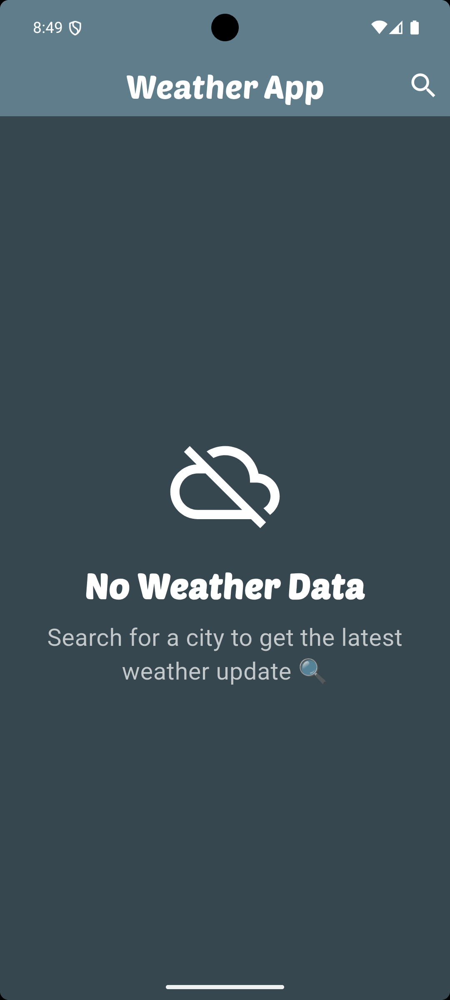
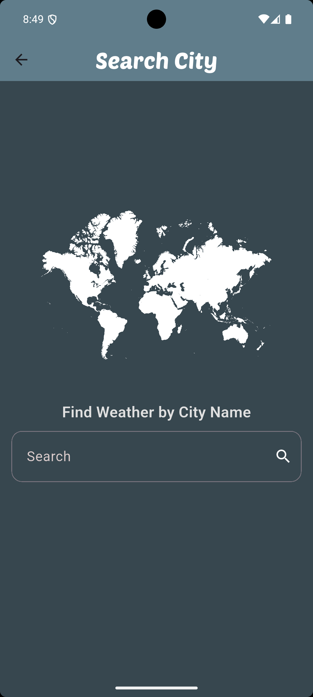
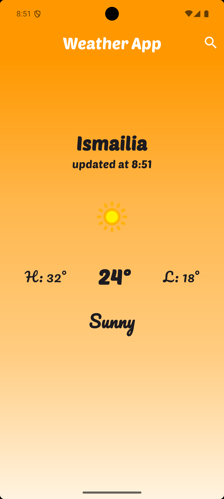
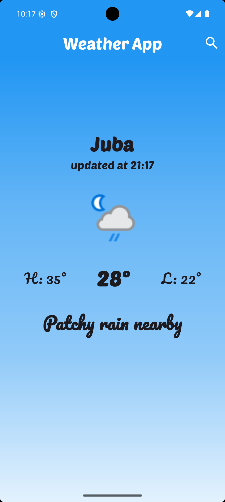
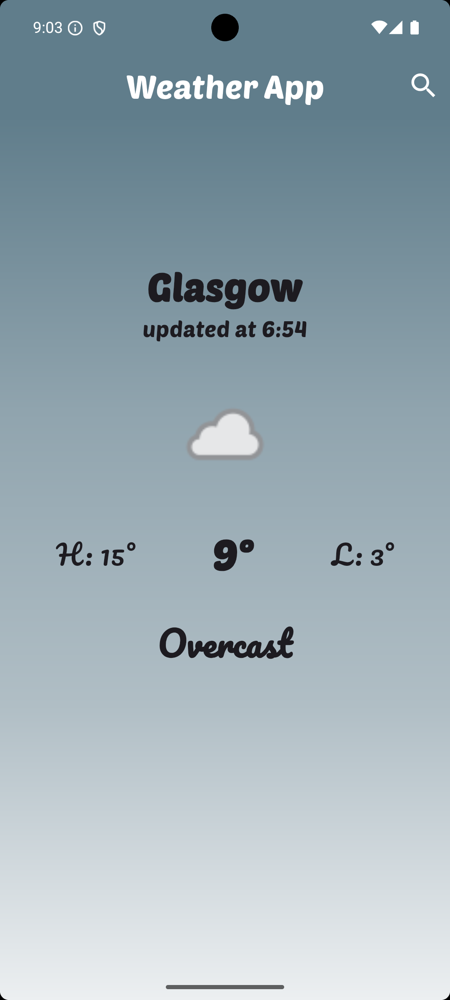

# Weather App 🌤️

A weather application that displays current weather information for different cities with a dynamic background that changes based on weather conditions.

## Features ✨

- Display current weather information for any city
- Search for cities
- Automatically change background based on weather conditions
- User-friendly interface
- Display special message when there's no internet connection

## Screenshots 🖼️

<div style="display: flex; flex-wrap: wrap; gap: 10px; justify-content: space-between;">
    <div style="flex: 1; min-width: 150px;">
        <p><strong>No Connection</strong></p>
        
    </div>
    <div style="flex: 1; min-width: 150px;">
        <p><strong>Search Page</strong></p>
        
    </div>
    <div style="flex: 1; min-width: 150px;">
        <p><strong>Sunny Weather</strong></p>
        
    </div>
    <div style="flex: 1; min-width: 150px;">
        <p><strong>Rainy Weather</strong></p>
        
    </div>
    <div style="flex: 1; min-width: 150px;">
        <p><strong>Cloudy Weather</strong></p>
        
    </div>
</div>

## Project Structure

```
lib/
  ├── cubits/get_weather_cubit/
  │     ├── get_weather_cubit.dart
  │     └── get_weather_state.dart
  ├── models/
  │     └── weather_model.dart
  ├── pages/
  │     ├── home_page.dart
  │     └── search_page.dart
  ├── services/
  │     └── weather_service.dart
  └── widgets/
        ├── no_weather_info.dart
        └── weather_info.dart
```

## Dynamic Background

The app features a background that automatically changes based on the weather condition:
- ☀️ Sunny background for sunny weather
- 🌧️ Rainy background when it's raining
- ☁️ Cloudy background for cloudy conditions

## Key Components 🧩

### Widgets
- `no_weather_info.dart`: Displayed when no weather information is available
- `weather_info.dart`: Shows weather information after selecting a city

### Pages
- `home_page.dart`: The main page that displays weather information
- `search_page.dart`: Page for searching cities

### Services
- `weather_service.dart`: Responsible for handling the weather API

### Models
- `weather_model.dart`: Data model for weather information

### Cubits (State Management)
- `get_weather_cubit.dart`: Manages weather data fetching state
- `get_weather_state.dart`: Defines different states for the weather fetching process

## Requirements 📋

- Flutter 3.0 or higher
- Dart 2.17 or higher

## Installation 🚀

1. Clone this repository:
```bash
git clone https://github.com/yourusername/weather_app.git
```

2. Navigate to the project directory:
```bash
cd weather_app
```

3. Install dependencies:
```bash
flutter pub get
```

4. Run the app:
```bash
flutter run
```

## Configuration

This project uses environment variables to store sensitive data like the weather API key. Follow these steps:

1. Create a `.env` file in the root of your project:

```
API_KEY=your_api_key_here
```

2. Make sure you have the `flutter_dotenv` package added in your `pubspec.yaml`:

```yaml
dependencies:
  flutter_dotenv: ^5.0.2
```

3. Import and load the `.env` file in your `main.dart`:

```dart
import 'package:flutter_dotenv/flutter_dotenv.dart';

void main() async {
  await dotenv.load();
  runApp(MyApp());
}
```

4. Use your API key inside `weather_service.dart` like this:

```dart
import 'package:flutter_dotenv/flutter_dotenv.dart';

final apiKey = dotenv.env['API_KEY'];
```

5. Add `.env` to your `.gitignore` to keep it private:

```
.env
```

## License

This project is licensed under the MIT License - see the LICENSE file for details.

